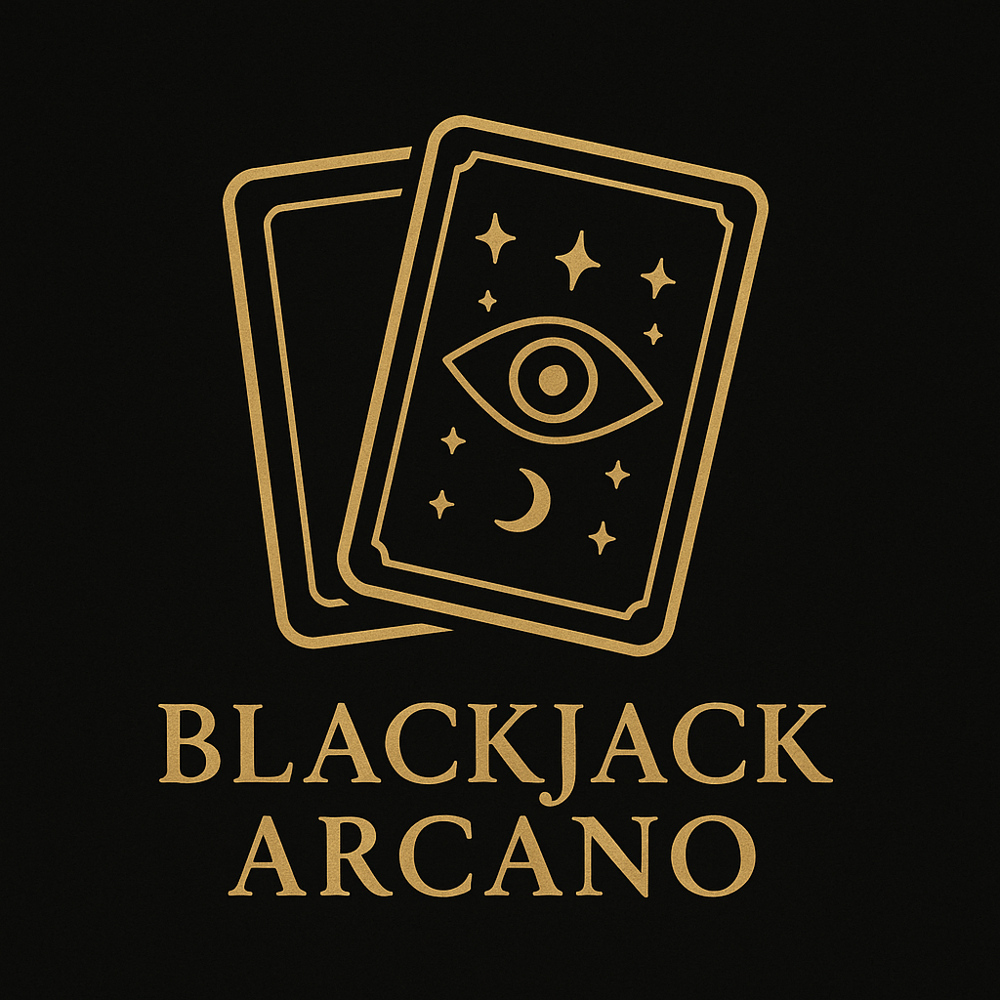

# Blackjack Arcano

> Projeto desenvolvido para a disciplina **Comunicação Organizacional (EC46DB)**

## Metas dos desenvolvedores
- Criar um jogo de cartas simples, acessível e estratégico, **inspirado no blackjack**.
- Equilibrar sorte e habilidade, **recompensando boas decisões do jogador**.
- Integrar um sistema de pontuação que mescla elementos do **blackjack** e do **pôquer**.
- Introduzir cartas com **efeitos especiais** que trazem variedade e imprevisibilidade ao jogo.

## Objetivos do jogo
- Somar o valor das cartas para chegar o mais próximo possível de **33 pontos**, sem ultrapassar.
- Obter **combinações** (par, trinca, sequência e cor) para ganhar **bônus de pontuação**.
- Usar os **efeitos especiais** das cartas a seu favor para influenciar o resultado da rodada.

## Diferenças do blackjack tradicional
- O objetivo é atingir **33 pontos**, em vez de **21**.
- **Combinações de cartas** também contam pontos na pontuação final.
- É utilizado um **baralho de tarô**, em vez do tradicional **baralho francês**:

| Característica   | Baralho Francês         | Baralho de Tarô                |
| ---------------- | ----------------------- | ------------------------------ |
| Nº de cartas     | 52 (ou 54 com curingas) | 78                             |
| Figuras          | Valete, Dama, Rei       | Valete, Cavaleiro, Rainha, Rei |
| Arcanos Maiores  | ❌ Não tem              | ✅ Tem (22 cartas únicas)      |

- As *cartas únicas* do Tarô (**"O Mago", "A Morte", "O Diabo",** etc) ativam **efeitos especiais**, levando o jogador a tomar **decisões estratégicas** influenciadas pela **sorte**.

## Cartas

### Arcanos Menores
- Cartas **numéricas** têm valor igual ao número que representam.
- As cartas **Valete**, **Cavaleiro**, **Rainha** e **Rei** valem **10 pontos** cada.
- O **Ás** pode valer **1 ponto** ou **11 pontos**, conforme o que for mais vantajoso para a mão do jogador.

### Arcanos Maiores
- **Arcanos Maiores** valem **1 ponto** e ativam **efeitos especiais** que influenciam a partida:

| Nº    | Arcano Maior          | Efeito Especial                                                                                            | Tempo de Ativação |
| ----- | --------------------- | ---------------------------------------------------------------------------------------------------------- | ----------------- |
| 0     | **O Louco**           | Compre três cartas sem se preocupar com o estouro. Mas cuidado: se sair ileso, perde imediatamente.        | Imediato          |
| I     | **O Mago**            | Canalize sua vontade: escolha um valor entre 2 e 10 para somar à sua pontuação (**buff**).                 | Imediato          |
| II    | **A Sacerdotisa**     | Com um olhar além do véu, revele as próximas três cartas do baralho.                                       | Imediato          |
| III   | **A Imperatriz**      | Dissipa todos os **debuffs** do jogador, como um gesto de graça. Se *não* houver **debuff**, receba um **buff** de 2 pontos. O estouro é ignorado nesta rodada.                                                                                                                                      | Imediato          |
| IV    | **O Imperador**       | Uma vez por partida, imponha ordem: ignore o estouro e retorne a última carta comprada ao baralho.         | Passiva           |
| V     | **O Hierofante**      | Com sabedoria ritual, escolha uma carta da sua mão e troque por uma nova.                                  | Imediato          |
| VI    | **Os Amantes**        | O destino oferece duas opções de carta: escolha uma para manter, a outra é descartada.                     | Imediato          |
| VII   | **O Carro**           | Avance com determinação: compre uma carta e, se desejar, recuse-a para comprar outra.                      | Imediato          |
| VIII  | **A Justiça**         | A balança pesa com equidade: se a diferença de pontuação entre o jogador e o dealer for de até 3 pontos, considera-se empate.                                                                                                                                      | Imediato          |
| IX    | **O Eremita**         | Em silêncio e reflexão, devolva uma carta comprada ao baralho.                                             | Imediato          |
| X     | **A Roda da Fortuna** | O destino gira: triplique sua aposta em vitória, dobre-a em derrota ou sofra um **debuff** de 5 pontos.    | Imediato          |
| XI    | **A Força**           | Com sua força interior, anule o efeito do próximo Arcano Maior ativado.                                    | Passiva           |
| XII   | **O Enforcado**       | Em um sacrifício, receba 3 pontos de **debuff** e substitua toda a sua mão por duas novas cartas, mantendo **O Enforcado**.                                                                                                                                 | Imediato          |
| XIII  | **A Morte**           | Devolva três cartas aleatórias da mão ao baralho, marcando o fim de um ciclo. Se não houver cartas suficientes, receba um **debuff** de 5 pontos.                                                                                                                                      | Imediato          |
| XIV   | **A Temperança**      | Com equilíbrio, diminua sua pontuação em um valor entre 2 e 10 (**debuff**).                               | Imediato          |
| XV    | **O Diabo**           | Ousada escolha: triplique sua aposta em vitória, pague o dobro em derrota, receba um **buff** ou **debuff** aleatório entre -10 e +20 pontos, ou devolva a carta ao fundo do baralho.                                                                                                                                     | Imediato          |
| XVI   | **A Torre**           | O caos se instala: a aposta é reduzida pela metade. Descarte uma carta e receba um **debuff** de 10 pontos.| Imediato          |
| XVII  | **A Estrela**         | Sob a proteção das estrelas, ignore o estouro na próxima rodada. Se perder, pague apenas metade da aposta. | Passiva           |
| XVIII | **A Lua**             | Sob o véu do mistério, repita o efeito do último Arcano Maior ativado. Se nenhum efeito anterior ocorreu, o destino decide: vitória ou derrota, guiados pela sorte.                                                                                                                                       | Imediato          |
| XIX   | **O Sol**             | Sob a luz do Sol, se o jogador ganhar, recebe 50% a mais; se perder, paga 50% a menos.                     | Passiva           |
| XX    | **O Julgamento**      | No momento do julgamento, se o jogador perder, a partida é reiniciada, oferecendo uma nova chance.         | Passiva           |
| XXI   | **O Mundo**           | Com a harmonia do universo, garante vitória automática se a pontuação é maior que 27.                      | Imediato          |

## Bônus de pontuação
Além da soma das cartas, **combinações** concedem bônus adicionais de pontuação:

| Combinação           | Requisitos                                      | Bônus de Pontuação |
| -------------------- | ----------------------------------------------- | ------------------ |
| **Par**              | Duas cartas do mesmo valor.                     | +1 pontos          |
| **Trinca**           | Três cartas do mesmo valor.                     | +3 pontos          |
| **Sequência**        | Três cartas em sequência.                       | +2 pontos          |
| **Cor**              | Três cartas do mesmo naipe.                     | +2 pontos          |

### Hierarquia para as combinações:

| Carta      | Valor ordinal (para combinações) |
| ---------- | -------------------------------- |
| Ás         | 1.                               |
| 2–10       | 2 a 10.                          |
| Valete     | 11.                              |
| Cavaleiro  | 12.                              |
| Rainha     | 13.                              |
| Rei        | 14.                              |
| Ás         | 15.                              |

## Como Jogar
1. O jogador realiza sua aposta.
2. As cartas são embaralhadas.
3. O jogador e o dealer recebem duas cartas cada.
4. O jogador escolhe entre **Hit** (comprar uma carta) ou **Stand** (manter a mão atual).
5. Se o jogador **estourar** (ultrapassar 33 pontos), sofre **derrota imediata**.
6. Caso escolha **Stand**, o dealer comprará cartas até atingir, no mínimo, 27 pontos.
7. Se o dealer **estourar**, o jogador obtém **vitória imediata**.
8. Caso contrário, compara-se a pontuação, e vence quem tiver mais pontos.

## Restrições
1. Nenhuma das cartas distribuídas no início do jogo pode ser um Arcano Maior.
2. O dealer não pode comprar Arcanos Maiores.
3. As cartas compradas por Arcanos Maiores são sempre Arcanos Menores.
4. Os bônus obtidos por combinação de cartas são cumulativos.
5. Todas as cartas devolvidas devem ser retornadas ao fundo do baralho.