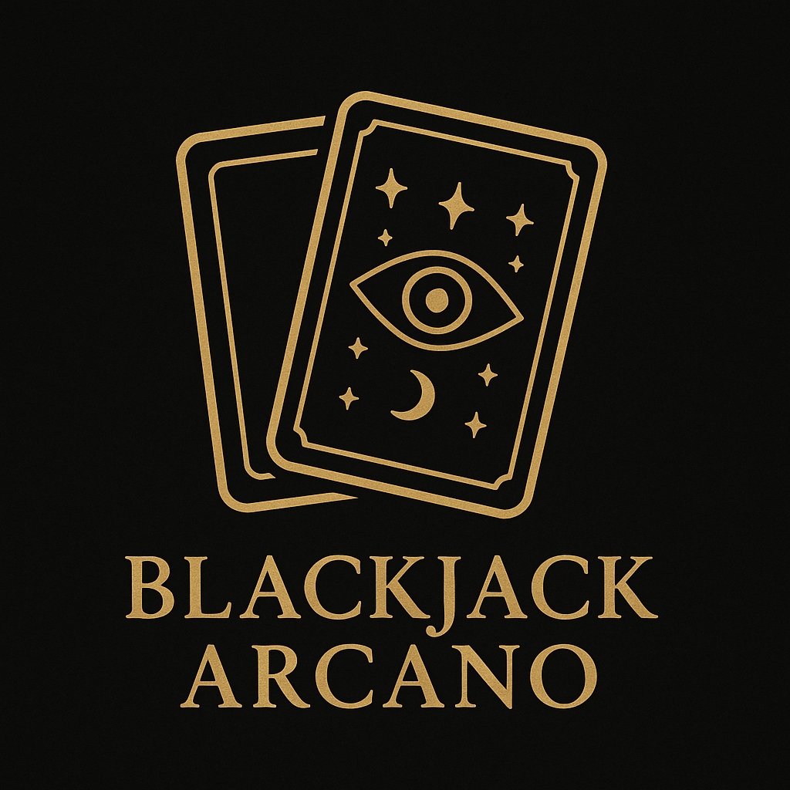

# Blackjack Arcano

> Projeto desenvolvido para a disciplina **Comunicação Organizacional**.

---

## Introdução

- Jogo de cartas simples e estratégico, **inspirado no blackjack**.
- Plataformas **Windows/Linux/Mac**.
- Equilibrar **sorte** e **habilidade**.
- Elementos do **blackjack** e do **pôquer**.
- Cartas com **efeitos especiais**.

---

## Objetivos

- Somar o mais próximo possível de **33 pontos**.
- Formar **combinações** para ganhar **bônus de pontuação**.
- Ganhar **apostas**.
- Usar os **efeitos especiais** das cartas a seu favor para influenciar o resultado da rodada.

> A rodada termina quando:
>
> - O jogador decide "parar" (**stand**).
>
> - Ultrapassa 33 pontos (**estouro**).

---

## Diferenças

- **33 pontos**, em vez de **21**.
- **Combinações** também contribuem para a pontuação final.
- É possível:
    - **Apostar** em uma **combinação**.
    - **Devolver** um **número limitado de cartas**.
- Não é possível:
    - Opção **"Seguro"**.
    - Mais de cinco cartas na mão.
    - Ver cartas do dealer.
- Utiliza-se um **baralho de tarô**, em vez do tradicional **baralho francês**.

---

## Baralho de Tarô

- **Arcanos Menores**:
    - Cartas **numéricas** (2-10).
    - **Ás**.
    - **Valete**, **Cavaleiro**, **Rainha** e **Rei**.
- **Arcanos Maiores**:
    - **O Mago**, **A Morte**, **O Diabo**, etc.
    - Ativam **efeitos especiais**.

---

## Valor das Cartas

- Cartas **numéricas**:
    - Valor igual ao número que representam.
- **Ás**:
    - **1 ponto** ou **11 pontos**.
- **Valete**, **Cavaleiro**, **Rainha** e **Rei**:
    - **10 pontos** cada.
- **Arcanos Maiores**:
    - Sem valor

---

## Alguns Arcanos Maiores

| Nº    | Arcano Maior          | Efeito Especial                                                                                                                                                     | Ativação   |
| ----- | --------------------- | ------------------------------------------------------------------------------------------------------------------------------------------------------------------- | ---------- |
| I     | **O Mago**            | Canalize sua vontade: escolha um valor entre 2 e 5 para receber um **buff** na pontuação.                                                                           | Voluntária |
| II    | **A Sacerdotisa**     | Com um olhar além do véu, revele as três cartas seguintes, vislumbrando o futuro.                                                                                   | Voluntária |
| III   | **A Imperatriz**      | Dissipe os **debuffs** e ignore o estouro desta rodada como um gesto de graça.                                                                                      | Voluntária |
| VIII  | **A Justiça**         | A balança da equidade pesa: se a diferença entre sua pontuação e a do dealer for de até 3 pontos, a vitória é compartilhada.                                        | Automática |
| X     | **A Roda da Fortuna** | O destino gira: dobre sua aposta em vitória, dobre-a em derrota ou sofra um **debuff** de 5 pontos.                                                                 | Automática |
| XII   | **O Enforcado**       | Em um sacrifício, receba 3 pontos de **debuff** e substitua toda a sua mão por duas novas cartas.                                                                   | Voluntária |
| XIII  | **A Morte**           | Devolva três cartas aleatórias da sua mão ao baralho, encerrando um ciclo. Se não houver cartas suficientes, receba um **debuff** de 5 pontos.                      | Voluntária |
| XV    | **O Diabo**           | Ousada escolha: dobre sua aposta em vitória, mas pague o triplo em derrota, ou receba um **buff** ou **debuff** aleatório entre -10 e +20 pontos.                   | Voluntária |
| XVIII | **A Lua**             | Sob o véu do mistério, repita o efeito do último Arcano Maior ativado. Se nenhum efeito anterior ocorreu, o destino decide: vitória ou derrota, guiados pela sorte. | Automática |

---

## Combinações

| Combinação           | Requisitos                                      | Bônus de Pontuação | Multiplicador (em aposta) |
| -------------------- | ----------------------------------------------- | ------------------ | ------------------------- |
| **Par**              | Duas cartas do mesmo valor.                     | +1 pontos          | x1.25                     |
| **Trinca**           | Três cartas do mesmo valor.                     | +3 pontos          | x3                        |
| **Sequência**        | Três cartas em sequência.                       | +2 pontos          | x1.5                      |
| **Cor**              | Três cartas do mesmo naipe.                     | +2 pontos          | x1.5                      |
| **Sequência de Cor** | Três cartas em sequência do mesmo naipe.        | +4 pontos          | x4                        |

---

## Hierarquia para as combinações:

| Carta      | Valor ordinal (para combinações) |
| ---------- | -------------------------------- |
| Ás         | 1.                               |
| 2–10       | 2 a 10.                          |
| Valete     | 11.                              |
| Cavaleiro  | 12.                              |
| Rainha     | 13.                              |
| Rei        | 14.                              |
| Ás         | 15.                              |

---

## Apostas
- Aposte em uma única **combinação**:
    - **Antes** de completar a combinação.
    - Receba um **multiplicador de retorno**.
    - Acumulam com **A Roda da Fortuna** ou **O Diabo**.

---

## Como Jogar
1. O jogador realiza sua **aposta inicial**.
2. As cartas são **embaralhadas**.
3. O jogador e o dealer recebem **duas cartas** cada.

---

4. O jogador escolhe entre as seguintes opções:
    - **Bet**: Apostar em uma combinação de par, trinca, sequência, cor ou sequência de cor.
    - **Hit**: Comprar uma carta.
        - O jogador pode ter até cinco cartas na mão. 
    - **Drop**: Descartar uma carta.
        - O jogador pode descartar até cinco cartas por rodada. 
    - **Spell**: Usar um Arcano Maior de ativação voluntária.
        - A carta utilizada será devolvida ao baralho. 
        - É permitido usar no máximo três arcanos por rodada.
    - **Stand**: Manter a mão atual.

---

5. Se o jogador **estourar** (ultrapassar 33 pontos), sofrerá **derrota imediata**.
6. Se o jogador escolher **Stand**, o dealer continuará comprando cartas até atingir, no mínimo, 27 pontos.
7. Se o dealer **estourar**, o jogador conquista **vitória imediata**.
8. Caso contrário, as pontuações são comparadas e vence quem tiver a **maior pontuação**.

> O dealer **não** pode comprar **Arcanos Maiores**.